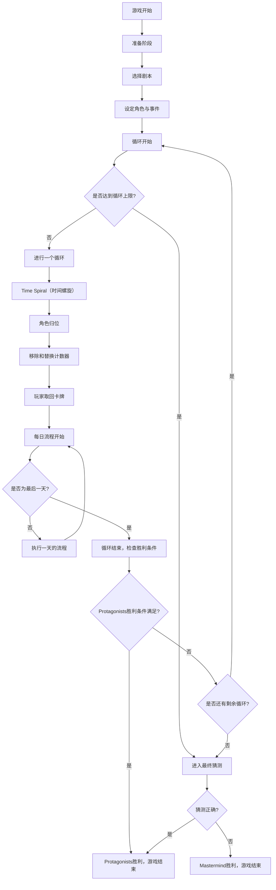

# Tragedy Looper 游戏引擎 README

## 项目简介

Tragedy Looper 是一款时间循环推理桌游，Protagonists 和 Mastermind 在循环中斗智斗勇。这是一个基于 Go 的 Tragedy Looper 游戏引擎，实现了游戏的关键逻辑与流程，包括剧情构建、角色管理、循环机制以及事件处理等内容。本项目可以作为开发者拓展该游戏的基础框架。

---

## 文件结构

```
tragedy-looper/engine/                # 游戏引擎根目录
├── cmd/                             # 命令行工具目录
│   └── main.go                      # 主程序入口
├── internal/                        # 内部包目录
│   ├── controllers/                 # 控制器目录
│   │   └── game_controller.go       # 游戏控制器
│   ├── models/                      # 模型目录
│   │   ├── board.go                 # 游戏板模型
│   │   ├── card.go                  # 卡牌模型
│   │   ├── character.go             # 角色模型
│   │   ├── counter.go               # 计数器模型
│   │   ├── game_state.go            # 游戏状态模型
│   │   ├── incident.go              # 事件模型
│   │   ├── phase.go                 # 游戏阶段模型
│   │   ├── player.go                # 玩家模型
│   │   ├── plot.go                  # 剧情模型
│   │   ├── role.go                  # 角色身份模型
│   │   └── script.go                # 剧本模型
│   ├── scenario/                    # 场景目录
│   │   └── first_steps/             # 入门剧本目录
│   │       ├── card.go              # 入门剧本卡牌定义
│   │       ├── character.go         # 入门剧本角色定义
│   │       ├── first_steps.go       # 入门剧本主要逻辑
│   │       ├── incident.go          # 入门剧本事件定义
│   │       ├── plot.go              # 入门剧本剧情定义
│   │       ├── roles.go             # 入门剧本角色身份定义
│   │       └── script.go            # 入门剧本脚本定义
│   └── services/                    # 服务层目录
├── resource/                        # 资源文件目录
├── .gitignore                       # Git忽略文件
├── go.mod                           # Go模块定义文件
└── README.md                        # 项目说明文档
```

### 关键目录说明

- cmd/: 主程序入口，包含命令行工具逻辑。
- internal/controllers/: 控制器目录，处理游戏控制逻辑（如游戏初始化和流程控制）。
- internal/models/: 核心数据模型：
    - board.go: 游戏板。
    - card.go: 卡牌定义。
    - character.go: 角色定义。
    - counter.go: 各种计时与计数器。
    - game_state.go: 全局游戏状态。
    - incident.go: 事件定义。
    - role.go: 角色身份管理。
    - script.go: 剧本逻辑。
- internal/scenario/: 场景目录，提供了多种剧本的实现。first_steps/ 是入门剧本示例。
- internal/services/: 服务层，封装业务逻辑。
- resource/: 用于存放游戏相关静态资源（如剧本描述或图像文件）。

---

## 游戏流程

### 流程概览
以下为 Tragedy Looper 游戏的主要流程：



### 每日流程

```mermaid
subgraph 每日流程 [每日流程]
    N1[1. 日出 - 早晨]
    N1 --> N2[2. Mastermind放置3张行动卡]
    N2 --> N3[3. Protagonists依次放置行动卡]
    N3 --> N4[4. 解析卡牌]
    N4 --> N5[5. Mastermind能力]
    N5 --> N6[6. Leader使用Goodwill能力]
    N6 --> N7[7. 事件发生检查]
    N7 --> N8[8. 切换Leader]
    N8 --> N9[9. 日落 - 夜晚]
end
```

#### 卡牌解析顺序
解析过程中各分类卡牌的优先级如下：

```mermaid
subgraph 解析卡牌顺序 [4. 解析卡牌顺序]
    N4a1[1. Forbid Movement卡]
    N4a1 --> N4a2[2. Movement卡]
    N4a2 --> N4a3[3. Other Forbid卡]
    N4a3 --> N4a4[4. 其他行动卡]
end
```

---

## 安装与运行

### 环境要求
- Go 版本: 推荐使用 Go 1.20 或更高版本。
- 操作系统支持: 跨平台支持（Windows, MacOS, Linux）。

### 克隆项目
```bash
git clone https://github.com/<你的仓库地址>/tragedy-looper.git
cd tragedy-looper/engine
```

### 运行主程序
在项目目录下执行以下命令：
```bash
go run cmd/main.go
```

---

## 贡献指南

欢迎对本项目进行贡献！以下是贡献流程：
1. Fork 仓库。
2. 创建你的分支 (`git checkout -b feature/my-feature`)。
3. 提交更改 (`git commit -am 'Add some feature'`)。
4. 推送到远程分支 (`git push origin feature/my-feature`)。
5. 提交 Pull Request。

详情请查阅 [CONTRIBUTING.md](CONTRIBUTING.md)。

---

## 许可证

本项目遵循 [MIT License](LICENSE)。

---

## 参考资料

- 游戏规则: 请参考项目中的 `resource/` 文件夹，或访问官方桌游规则介绍。
- 更多信息: 如需了解游戏背景与学习规则，可查阅官方指南 —— Protagonist Handbook 和 Mastermind Handbook。

---

### 联系开发者

如果你在使用中遇到问题或者有建议，请通过以下方式联系我们：

- 电子邮件: support@tragedylooper.dev
- GitHub Issues: [提交问题](https://github.com/<你的仓库地址>/issues)