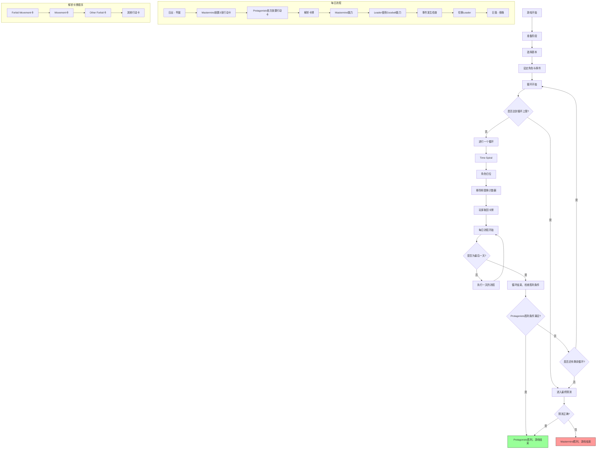

# Tragedy Looper 游戏引擎 README

### 流程概览
以下为 Tragedy Looper 游戏的主要流程：

```mermaid
flowchart TD
    A[游戏开始] --> B[准备阶段]
    B --> C[选择剧本]
    C --> D[设定角色与事件]
    D --> E[循环开始]
    E --> F{是否达到循环上限?}
    F -->|否| G[进行一个循环]
    F -->|是| Z[进入最终猜测]
    G --> H[Time Spiral]
    H --> I[角色归位]
    I --> J[移除和替换计数器]
    J --> K[玩家取回卡牌]
    K --> L[每日流程开始]
    L --> M{是否为最后一天?}
    M -->|否| N[执行一天的流程]
    M -->|是| O[循环结束，检查胜利条件]
    N --> L
    O --> P{Protagonists胜利条件满足?}
    P -->|是| Q[Protagonists胜利，游戏结束]
    P -->|否| R{是否还有剩余循环?}
    R -->|是| E
    R -->|否| Z
    Z --> S{猜测正确?}
    S -->|是| Q
    S -->|否| T[Mastermind胜利，游戏结束]

    subgraph DailyFlow[每日流程]
        N1[日出 - 早晨] --> N2[Mastermind放置3张行动卡]
        N2 --> N3[Protagonists依次放置行动卡]
        N3 --> N4[解析卡牌]
        N4 --> N5[Mastermind能力]
        N5 --> N6[Leader使用Goodwill能力]
        N6 --> N7[事件发生检查]
        N7 --> N8[切换Leader]
        N8 --> N9[日落 - 夜晚]
    end

    subgraph CardAnalysis[解析卡牌顺序]
        N4a1[Forbid Movement卡] --> N4a2[Movement卡]
        N4a2 --> N4a3[Other Forbid卡]
        N4a3 --> N4a4[其他行动卡]
    end

    style Q fill:#9f9,stroke:#333
    style T fill:#f99,stroke:#333
```

